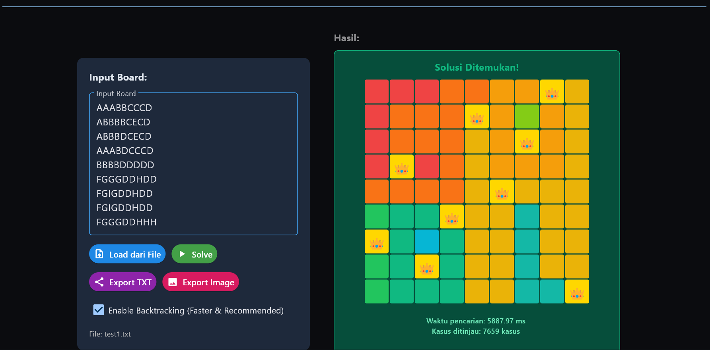

# Tucil Strategi Algoritma 1

## Deskripsi Program
Program ini ditujukan untuk mencari solusi dari *game* Queens LinkedIn dengan menggunakan algoritma Brute Force, tetapi juga ada kemungkinan permainan tidak memiliki solusi jika tidak ada konfigurasi yang memenuhi.

## Batasan Permainan
- Setiap baris dan kolom maksimal memiliki 1 *queen*
- Dalam 1 daerah, maksimal hanya boleh terdapat 1 *queen*
- *Queen* tidak boleh bersebelahan secara horizontal, vertikal, maupun diagonal (jarak dekat)

## Cara Menjalankan GUI
1. Pastikan Python sudah terinstall (disarankan Python 3.10 atau lebih baru).
2. Install *library* yang dibutuhkan
    ```
    pip install flet pillow

    ```
3. Lakukan clone repository
4. Masuk ke folder utama project
5. Jalankan perintah berikut
    ```
    python src/maingui.py

    ```

## Cara Menjalankan Program (tanpa GUI -- *tidak selengkap GUI*)

1. Pastikan Python sudah terinstall (disarankan Python 3.10 atau lebih baru).
2. Install *library* yang dibutuhkan
    ```
    pip install flet pillow

    ```
3. Lakukan clone repository
4. Masuk ke folder utama project
5. Jalankan perintah berikut
    ```
    python src/maincli.py

    ```


